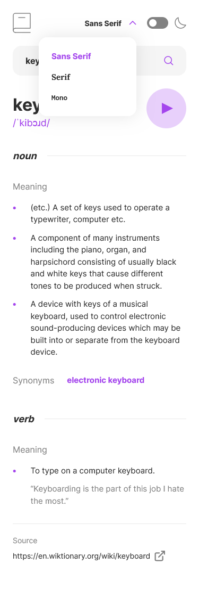
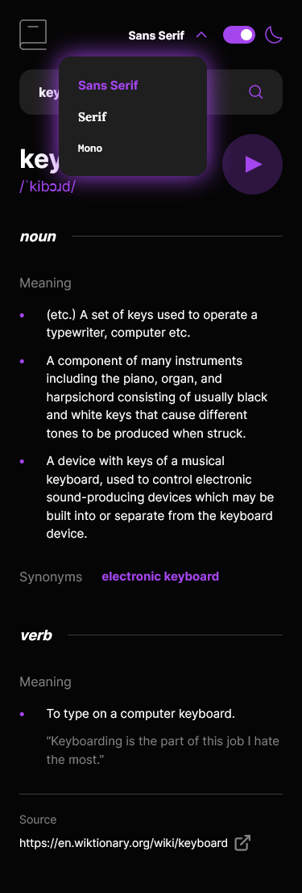
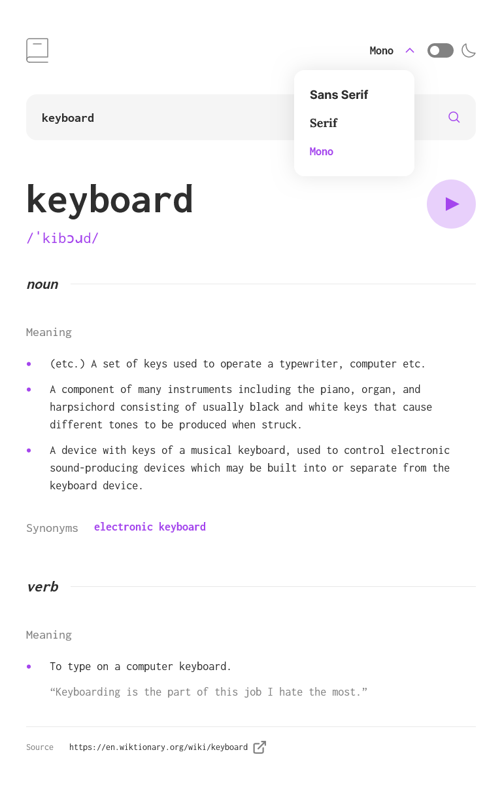
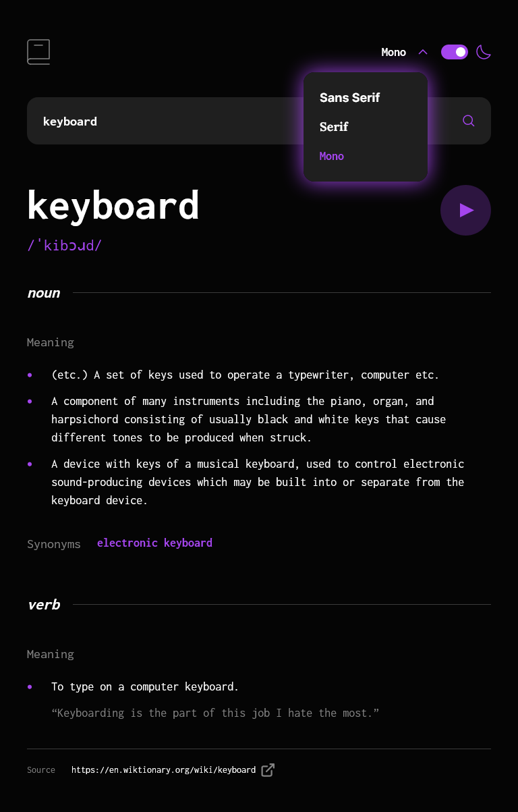
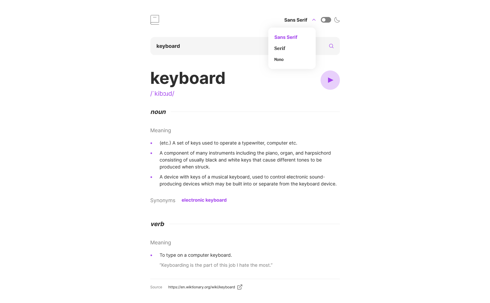
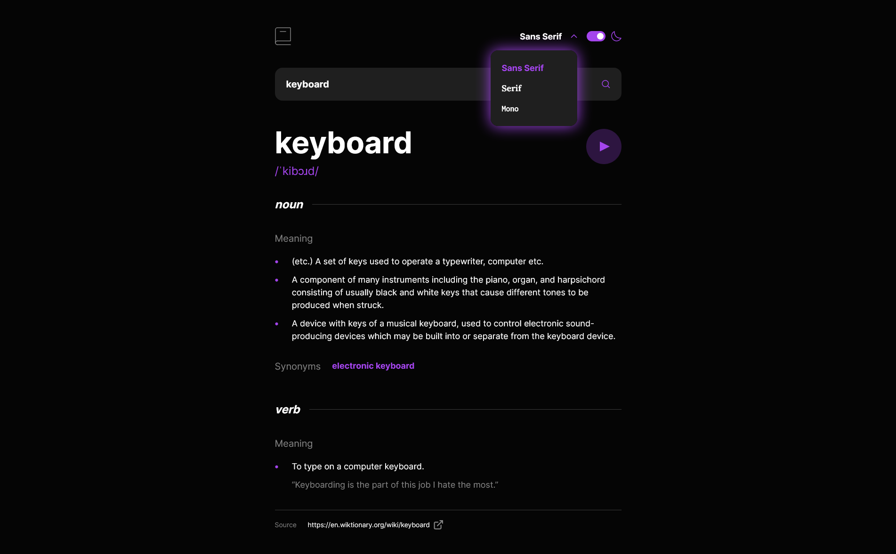

# Frontend Mentor - Dictionary web app solution

This is a solution to the [Dictionary web app challenge on Frontend Mentor](https://www.frontendmentor.io/challenges/dictionary-web-app-h5wwnyuKFL). Frontend Mentor challenges help you improve your coding skills by building realistic projects.

## Links

- Solution URL: [Frontend Mentod Solution Page](https://your-solution-url.com)
- Live Site URL: [Github Pages Site](https://karolbanat.github.io/fem-svelte-dict-web-app/)

## Built with

- Semantic HTML5 markup
- CSS custom properties
- Mobile-first workflow
- TypeScript
- [Vite](https://vitejs.dev/)
- [Svelte](https://svelte.dev/)

## Author

- Frontend Mentor - [@karolbanat](https://www.frontendmentor.io/profile/karolbanat)

## Screenshots

